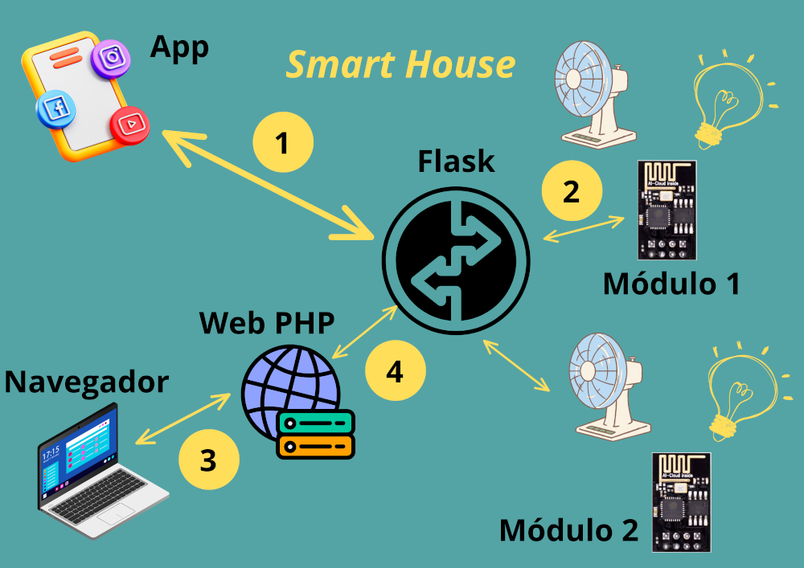

## 
Smart Home

O projeto tem como objetivo fazer a construção e interação com tomadas inteligentes.
Os recursos utilizados para o projeto foram:
- ESP01: para interagir com as tomadas (ligar/desligar)
- Flask: faz a autenticação do usuário e comunicação com os módulos ESP01
- AppInventor: utilizado para construir aplicação para smartphone que interage com o Flask com o objetivo de enviar comandos para os módulos ESP01

### 
Funcionamento do projeto

##### _**Comunicação utilizando o App**_
1 - Ao utilizar o aplicativo, será pedido o usuário/senha. Os dados serão enviados para a aplicação Flask para fazer autenticação do mesmo (seta 1). Após autenticação serão retornados para o aplicativo os Módulos ESP disponíveis em cada cômodo da casa.
2 - Com os módulos ESP listados no aplicativo, o usuário escolhe qual módulo integarir e envia o comando (liga/desliga) para a aplicação Flask (seta 1). A aplicação Flask recebe a solicitação e envia para o Módulo ESP correspondente (ex. seta 2).

##### _**Comunicação utilizando o Navegador**_
1 - Ao abrir o navegador, o usuário digitará o endereço do servidor web (Web PHP), solicitando o usuário/senha (seta 3)
2 - Ao digitar o usuário/senha, a aplicação Web PHP enviará a solicitação de autenticação (seta 4) para a aplicação Flask. Após autenticação serão retornados para o aplicativo os Módulos ESP disponíveis em cada cômodo da casa.
3 - Com os módulos ESP listados no navegador, o usuário escolhe qual módulo integarir e envia o comando (liga/desliga) para a aplicação Flask (seta 4). A aplicação Flask recebe a solicitação e envia para o Módulo ESP correspondente (ex. seta 2).